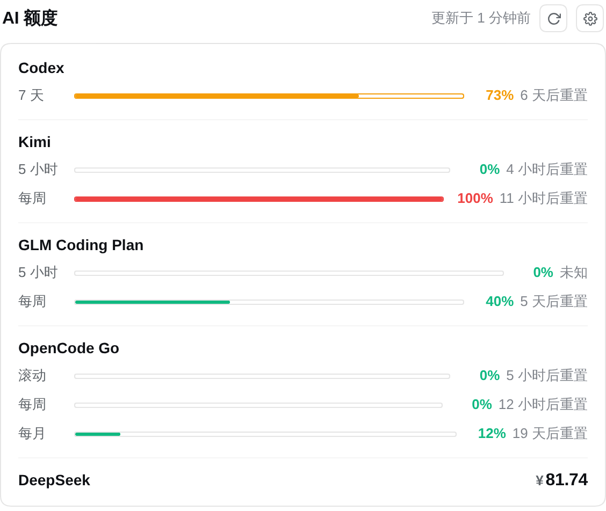

# 个人 DeepSeek Harness 插件

中文 | [English](README.md)

DeepSeek Harness 插件 Bundle：查询你的 AI 订阅额度 / 余额 —— **Codex**、**Kimi**、**GLM Coding Plan**、**DeepSeek**、**302.AI**、**OpenCode Go** 六个 provider 一处可见。

[](https://github.com/topics/dsh-plugin) [](./LICENSE)

这是为 `advanced_research` 工作区维护的公开 DeepSeek Harness 插件 Bundle。

## 预览



*设置页：Codex / Kimi / GLM Coding Plan / OpenCode Go 的用量进度条、DeepSeek / 302.AI 的简洁余额，手动刷新 + 相对时间的更新时间；标题栏的齿轮按钮进入内嵌的可见性设置，每个 provider 一个开关。*

## 功能

- **模型工具 `query_ai_quota`**：任何 agent 会话里直接问「查一下我的 AI 额度」，返回人类可读摘要。
- **设置页**：设置侧边栏新增「AI 额度」页，每个 provider 的用量进度条 / 余额 + 手动刷新。
- **每个 provider 可单独显示 / 隐藏**：设置区标题栏的齿轮按钮点进去，就是嵌在同一个设置页里的第二层 —— 每个 provider 一个开关。没检测到 Key / 登录态的 provider 仍列出但开关不可用，并直接写上缺什么（哪个 Key / 哪次登录 / 哪个 CLI）；能拨动的就是检测到了，不再另标「已检测到」。检测到的一律默认开启，以后新配的 Key 会自动出现。开关对设置页列表**和**输入框额度行同时生效；偏好存在浏览器 `localStorage`，点一下即时生效，不走 host、不需要重启。`query_ai_quota` 工具不受影响，始终返回全部 provider。
- **输入框额度行**：跟随当前 **provider 路由**（绝不看模型 ID —— 同一个模型可能由多个路由提供、额度彼此独立）的一行极简额度提示，新建页面与会话中都显示。
- **自动刷新**：host 每 `refreshIntervalMs`（默认 2 分钟）全量查询一次并写缓存，前端与工具秒回；`0` 关闭。此外**打开中的对话**每 60 秒静默重读一次当前 provider 的额度（不会闪加载态），所以长时间不关的会话不会一直停在打开时的旧余额；标签页隐藏时跳过，重新可见时立即补一次。
- **统一格式**：订阅制窗口 / 余额两种形态归一化，单个 provider 失败不影响其他。
- **跟随皮肤配色**:所有读数颜色都是 CSS 变量 —— 加载初音皮肤(dsk-miku-skin)时,输入框额度行与用量条变为柔和的初音青绿;没有皮肤时仍是原有的翠绿/琥珀/红三档。进度条到琥珀/红档时,它自己的描边也跟着同色,整条进度条是一个状态;正常档位仍是安静的中性描边。
- **不泄露密钥**：API key / token 永不进入工具输出、Remote 结果与日志。

Kimi 凭据按以下顺序解析：

1. `kimiApiKeyEnv` 指定的环境变量或 DSH 凭据引用；
2. `~/.kimi-code` 或 `~/.kimi` 下的 Kimi Code CLI OAuth 登录态。

随附 Profile patch 使用工作区中央凭据名称 `LLM_MOONSHOT_API_KEY`，仓库不会保存真实密钥。

## 安装

```sh
npx @deepseek-ai/dsh plugin --profile web add github:wuzhongyanqiu/dsh-plugins
```

Bundle 列表变化后需要重启 Web Profile。

## 配置

| 配置项 | 本 Bundle 默认值 | 作用 |
| --- | --- | --- |
| `timeoutMs` | `15000` | 单 provider 查询超时（毫秒） |
| `refreshIntervalMs` | `120000` | 全局自动刷新间隔（毫秒），`0` = 关闭 |
| `codexCli` | `codex` | codex CLI 命令名或绝对路径 |
| `deepseekApiKeyEnv` | `DEEPSEEK_API_KEY` | DSH 凭据引用名（回退同名环境变量） |
| `opencodeGoApiKeyEnv` | `OPENCODE_GO_API_KEY` | DSH 凭据引用名（回退同名环境变量） |
| `ai302ApiKeyEnv` | `AI_302_API_KEY` | DSH 凭据引用名（回退同名环境变量） |
| `glmApiKeyEnv` | `ZAI_CODING_CN_API_KEY` | GLM Coding Plan 的 DSH 凭据引用名（依次回退 `ZAI_CODING_API_KEY`、`GLM_CODING_API_KEY`） |
| `kimiApiKeyEnv` | `LLM_MOONSHOT_API_KEY` | Kimi API Key 的 DSH 凭据引用名（代码默认 `KIMI_API_KEY`，本 Bundle 的 patch 指向工作区中央凭据）；未配置时回退 Kimi Code CLI 的 OAuth 登录态 |
| `deepseekBaseUrl` | `https://api.deepseek.com` | DeepSeek API 基地址 |
| `opencodeBaseUrl` | `https://opencode.ai/zen/go/v1/usage` | OpenCode Go 用量端点 |
| `ai302BaseUrl` | `https://api.302.ai` | 302.AI API 基地址 |
| `glmBaseUrl` | `https://open.bigmodel.cn` | GLM Coding Plan 接口域名；只取 origin，所以填 `…/api/coding/paas/v4` 也可用。国际版填 `https://api.z.ai` |
| `kimiBaseUrl` | `https://api.kimi.com/coding/v1` | Kimi Code 用量端点基地址（追加 `/usages`） |
| `kimiOauthHost` | `https://auth.kimi.com` | Kimi OAuth 刷新端点（追加 `/api/oauth/token`） |
| `kimiClientId` | Kimi Code CLI 的公开 client id | OAuth client_id（一般无需改） |

## 输入框额度行的路由匹配

额度行读取当前所选模型的 **provider 路由**（如 `opencode-go-carrick`、`kimi-coding`、`deepseek-official`、`openai-codex`），绝不按模型 ID 匹配 —— OpenCode Go 路由下的 `kimi-k3` 属于 OpenCode Go 额度，而不是 Kimi 订阅。路由 id（或路由别名对应的 provider 显示名）包含 `302`、`opencode`、`codex`、`kimi`/`moonshot`、`deepseek`、`zai`/`zhipu`/`bigmodel`/`glm` 之一即被识别；其余路由不显示额度行，而不是显示另一个账号的余额。

额度行挂载期间每 60 秒重读一次该 provider（读 host 的暖缓存，不额外打上游接口）。若 host 快照本身已超过 10 分钟未更新（即 host 自动刷新被关闭或卡住），轮询会升级为真实查询，并限制为每个 provider 每 10 分钟最多一次。

## 密钥来源

- **DeepSeek / 302.AI / OpenCode Go**：优先走 DSH 凭据 seam 解析——`apiKeyEnv` 是凭据引用名（默认 `DEEPSEEK_API_KEY` / `AI_302_API_KEY` / `OPENCODE_GO_API_KEY`），因此配置在 DSH 的 key（如 `$DSH_HOME/.credentials.yaml`）优先；同名进程环境变量仅作兜底（非 DSH 独立部署）。OpenCode Go 额外回退 `~/.local/share/opencode/auth.json` 的 `opencode-go` 条目。
- **GLM Coding Plan**：同样走 DSH 凭据 seam，默认引用名 `ZAI_CODING_CN_API_KEY`，找不到时依次尝试 `ZAI_CODING_API_KEY`、`GLM_CODING_API_KEY`，所以国内版 / 国际版的 key 名都能直接用；国际版账号把 `glmBaseUrl` 改成 `https://api.z.ai`。
- **Kimi**：优先使用 `kimiApiKeyEnv` 引用的 API Key；未配置 key 时复用 Kimi Code CLI 的 OAuth 会话（过期自动续期，彻底失效时提示重新 `kimi login`）。
- **Codex**：无需 key，复用本地 codex CLI 登录态（PATH 上的 CLI）。

## 外部插件

工作区采用的第三方插件记录在 [PLUGINS.md](PLUGINS.md)。它们保持为独立安装依赖，方便审查各自的更新和权限。

## 安全

- API Key 和 OAuth Token 不会出现在工具结果或 Remote 返回值中。
- 本仓库只保存凭据变量名。
- Git 依赖属于宿主机可信代码；需要可复现安装时应固定到已审查 commit。

| Provider | 来源 |
| --- | --- |
| Codex | 本地 `codex app-server --stdio` JSON-RPC（`account/rateLimits/read`）— 5h / 7d 窗口 |
| Kimi | `GET {kimiBaseUrl}/usages`（`kimiApiKeyEnv` 引用的 API Key，或 Kimi Code CLI 的 OAuth 登录态） |
| GLM Coding Plan | `GET {glmBaseUrl}/api/monitor/usage/quota/limit`（Bearer key）— 5 小时额度周期 / 每周额度 / 每月 MCP 工具额度 |
| DeepSeek | `GET {deepseekBaseUrl}/user/balance`（Bearer key） |
| 302.AI | `GET {ai302BaseUrl}/dashboard/balance`（Bearer key） |
| OpenCode Go | `GET {opencodeBaseUrl}`（Bearer key） |

## 来源

初始额度实现基于 MIT 许可的 [`Carrick-K7/dsh-ai-quota`](https://github.com/Carrick-K7/dsh-ai-quota)，详见 [NOTICE.md](NOTICE.md)。

## 许可

MIT
